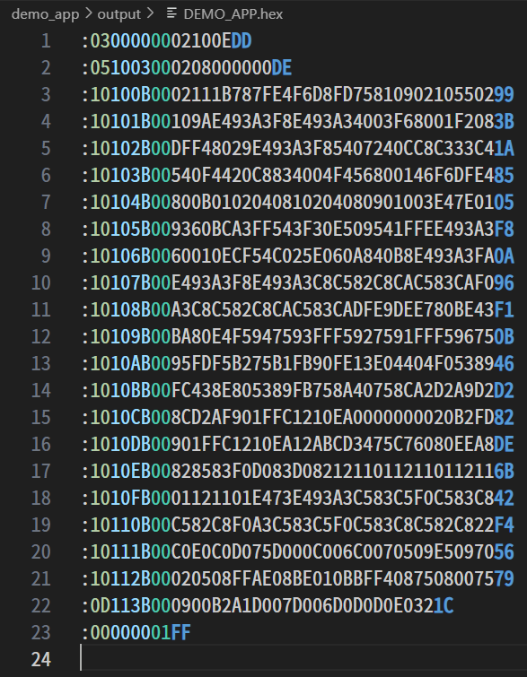
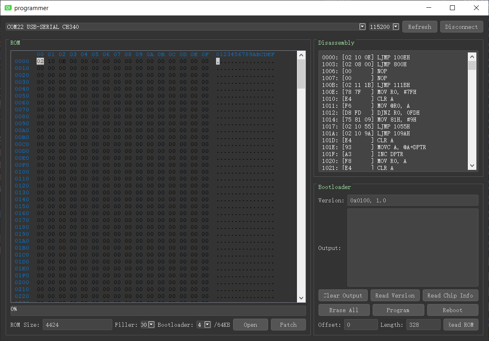
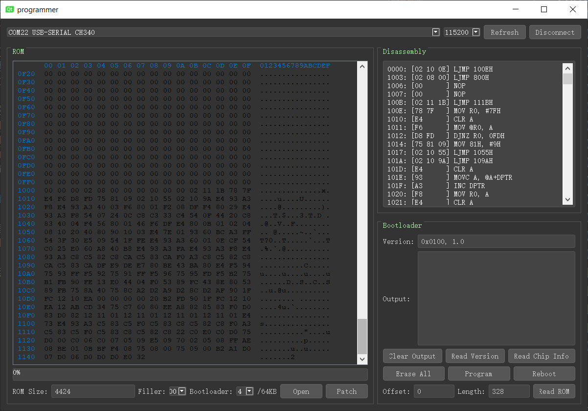
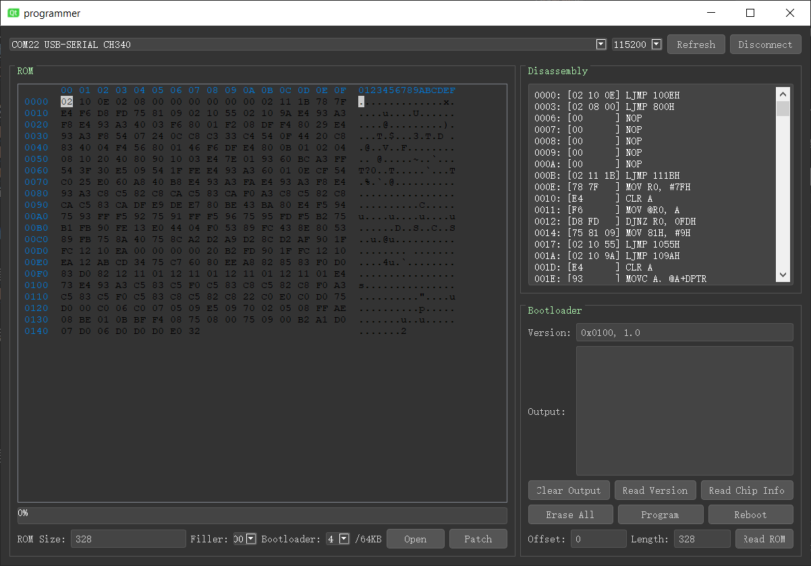

STC IAP DEMO
============

[中文](./README.md)

## 0. STC CPU Boot Process

Upon power-on, the STC's built-in internal ISP program is executed. If no serial port instruction requesting a download from the host computer is detected, it transitions to the user program.

`PC=0000H`, meaning the instruction is fetched from the `0`-th byte of the `ROM` space (analogous to `stm32`'s `Reset_Handler`, the reset interrupt entry). Typically, this is a `02 addr16` instruction, i.e., `LJMP addr16` (long jump instruction). `addr16` usually points to the content of `STARTUP.A51`, such as initializing `idata`, setting `sp`, etc., followed by executing `LJMP ?C_START` to jump to the user's `main` function.

At this point, we can take over the `CPU` and write a dedicated `BOOTLOADER` program to handle communication via `UART/USB/CAN`, etc., for `IAP` updates of the `USER_APP`—the actual business program. By setting flags, detecting a specific `PIN`, checking if the `USER_APP` is valid, etc., we can decide whether to jump to the `USER_APP` or remain in the `BOOTLOADER` waiting for updates from the host computer.

There are two key points:

1. Reasonably partition the `BOOTLOADER/USER_APP` space.
2. Redirect interrupts to the `USER_APP` space.

For point 1, you can use STC's official download software `AiCube-ISP` to set the user `EEPROM` size.

For point 2, you can write an assembly instruction at the original interrupt entry address (determined by the chip manufacturer, though generally an extension or minor modification of the 8051 interrupt addresses), such as `LJMP #USER_ISR_ADDR`, to jump to the `USER_APP`'s interrupt function.

Below, I will reverse-engineer its serial protocol, modify the code style, and add some features based on the STC official example `STC-Official-user-UART-ISP-bootloader-demo-STC8H8K64U-series`.

## 1. common.h

```c
/**
 * chip: STC8H8K64U
 * ram: 256B idata, 8KB xdata
 * flash: 64KB
 *   - 4KB for bootloader
 *   - 60KB for application
 */

#ifndef __COMMON_H__
#define __COMMON_H__

// #define MAIN_Fosc 11520000UL
// #define MAIN_Fosc 12000000UL
// #define MAIN_Fosc 22118400UL
#define MAIN_Fosc 24000000UL

#define STC_RAM_SIZE 0x2000  // STC8H8K64U has 8KB xdata

#define LDR_SIZE 0x1000     // bootloader flash space = 4KB
#define LDR_VERSION 0x0100  // bootloader version 1.0

#define DFU_TAG 0x12ABCD34UL  // force DFU mode
#define DFU_ADDR (STC_RAM_SIZE - sizeof(DFU_TAG))

#endif /* __COMMON_H__ */
```

Since the main frequency of `8H8K64U` is set by `AiCube-ISP`, both `BOOTLOADER` and `USER_APP` must use the same main frequency.

The `FLASH` address partitioning is also set by `AiCube-ISP`, so here we first define `LDR_SIZE`, i.e., the `FLASH` space occupied by the `BOOTLOADER`, to facilitate `BOOTLOADER` updates, `ISR` remapping calculations, and `USER_APP`'s `INTVECTOR/CLASSES` calculations.

Since `KEIL`'s built-in `STARTUP.A51` is used with `XDATALEN EQU 0`, the `XDATA` is not initialized during a soft reset of the chip. This allows setting a `dfuflag` at the end of the `8KB RAM`, i.e., at `DFU_ADDR`. If the `USER_APP` detects a pin change, receives a serial port instruction, or any other action triggering an update of the `USER_APP`, the `USER_APP` can set `dfuflag = DFU_TAG` and reset. The `BOOTLOADER`, upon detecting `dfuflag == DFU_TAG`, will remain in the `BOOTLOADER` waiting for download instructions from the host computer instead of immediately jumping to the `USER_APP`.

## 2. BOOTLOADER

The `BOOTLOADER` must implement:

1. Remapping `ISR`
2. Detecting whether to jump to the `USER_APP`
3. Receiving download instructions from the host computer to update the `USER_APP`

### 2.1 ISR Remapping

To facilitate adjusting the `FLASH` space partitioning, `update_isr.sh` is written:

```bash
#!/bin/bash

set -e

CURRENT_DIR=$( cd "$(dirname "${BASH_SOURCE[0]}")" ; pwd -P )
cd ${CURRENT_DIR}

COMMON_H=${CURRENT_DIR}/../common.h
ISR_ASM=${CURRENT_DIR}/src/isr.asm

# parse LDR_SIZE from COMMON_H like `#define LDR_SIZE 0x1000  // bootloader flash space`
LDR_SIZE=$(grep -oP '#define LDR_SIZE \K[0x0-9A-F]+' ${COMMON_H})

echo "LDR_SIZE=${LDR_SIZE}"

# convert the LDR_SIZE from `0xXXXX` to `XXXXH`
LDR_SIZE_HEX=$(printf "%04XH" ${LDR_SIZE})
echo "LDR_SIZE_HEX=${LDR_SIZE_HEX}"

# replace LDR_SIZE in ISR_ASM like `LDR_SIZE EQU 1000H`
sed -i "s/LDR_SIZE EQU .*/LDR_SIZE EQU ${LDR_SIZE_HEX}/" ${ISR_ASM}
```

It can be called using `git-bash` to calculate the base address for remapping `ISR` from the `LDR_SIZE` defined in `common.h` and update `isr.asm`:

```ASM
LDR_SIZE EQU 1000H

MAPISR MACRO ADDR
CSEG AT ADDR
LJMP LDR_SIZE + $
ENDM

MAPISR  0003H
MAPISR  000BH
MAPISR  0013H

...

END
```

### 2.2 Jump to USER_APP

When a jump should occur, execute:
```c
((void(code *)())(LDR_SIZE))(); // LJMP #LDR_SIZE, from here the CPU is running application code
```

### 2.3 Serial Port IAP

Refer to the protocol in [protocol.h](./bootloader/src/protocol.h) and [protocol.txt](./bootloader/src/protocol.txt).

## 3. USER_APP

The key is to set `INTVECTOR`, i.e., the interrupt vector base address, to `LDR_SIZE` during compilation, and set `CLASSES` during linking to place the generated code after `LDR_SIZE`.

Let's take a look at `USER_APP.HEX`:



The first generated instruction is at `0000H`, with machine code `02 100EH`. As mentioned earlier, this can be analogized to `STM32`'s `Reset_Handler`, but the 51 series does not consider `0000H` as the reset interrupt entry address; it is merely the fetch address for the first instruction upon power-on.
`100EH` contains the content of `STARTUP.A51`.

You can see `1003H` is the `INT0` interrupt. Since `DEMO_APP` does not implement this interrupt, it points to an incorrect address `0800H`. It is unclear how `C51` handles this.
`100BH` is the `TIMER 0` interrupt, correctly pointing to `111B`.

This `HEX` file with offset distribution cannot be directly used for burning by the `BOOTLOADER`. The `BOOTLOADER`'s `IAP` operation base address is `0`, which will be mapped to the actual `FLASH` space at `LDR_SIZE`. Therefore, the `HEX` must first be converted to `bin` format, and the code at `0000H` (`02 10 0E`) moved to `1000H`, combined with the subsequent content, and then shifted forward by `1000H` as a whole to obtain the `bin` data suitable for burning.

## 4. PROGRAMMER

With the theory and protocol in place, you can write your own programming software, though it can only be used when the `BOOTLOADER` program has already been burned (by `AiCube-ISP` ).

Click `Open` to open `DEMO_APP.HEX`. After conversion to `bin`, the distribution is as follows:





Then click `Patch` to shift the code at `1003H` forward by `1000H` as a whole, obtaining the data ready for direct burning:



Connect the serial port, `Erase All`, then `Program`, `Reboot`, and the `USER_APP` can run normally.
